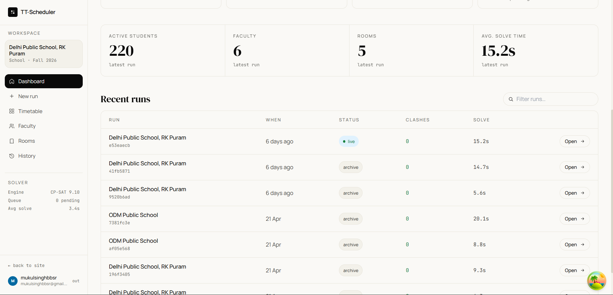
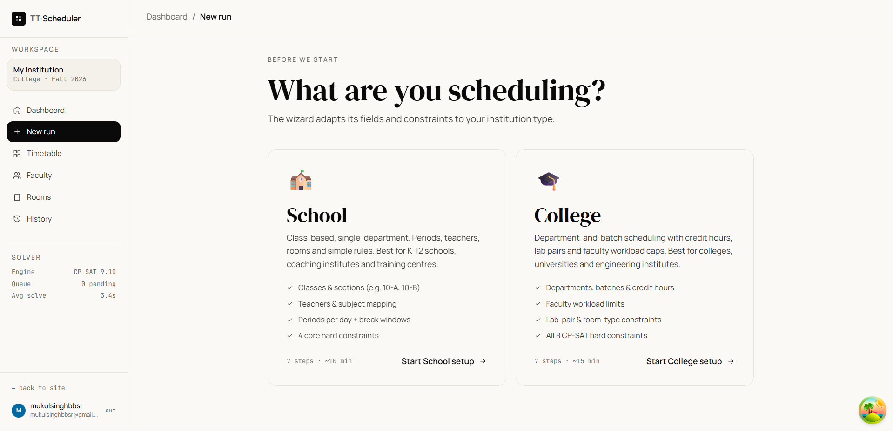
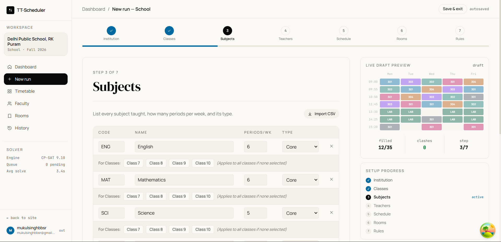
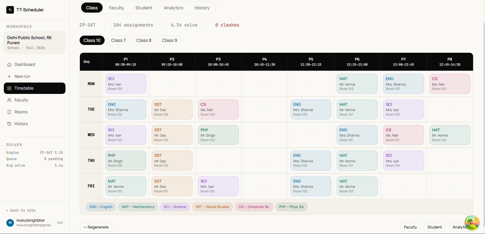
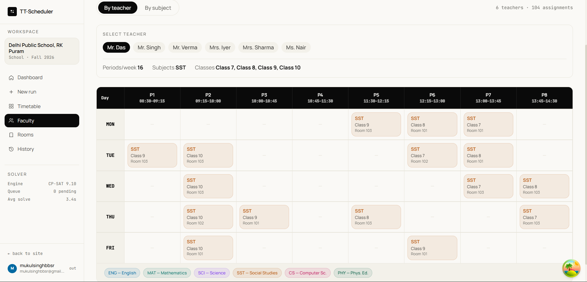
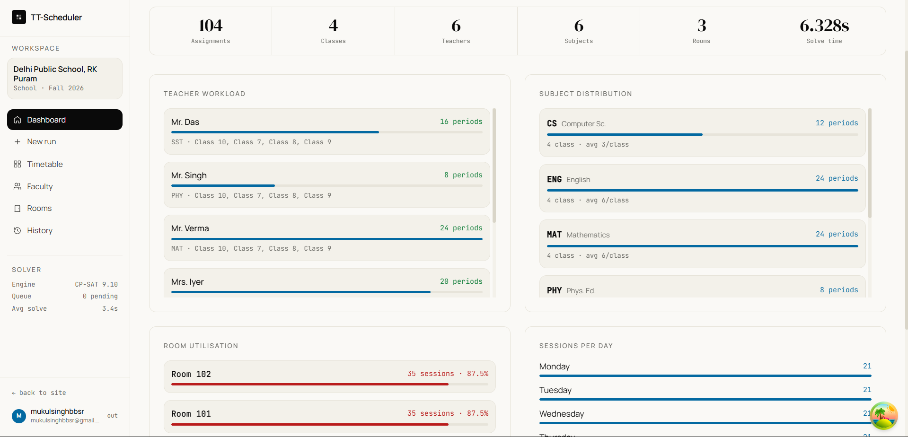
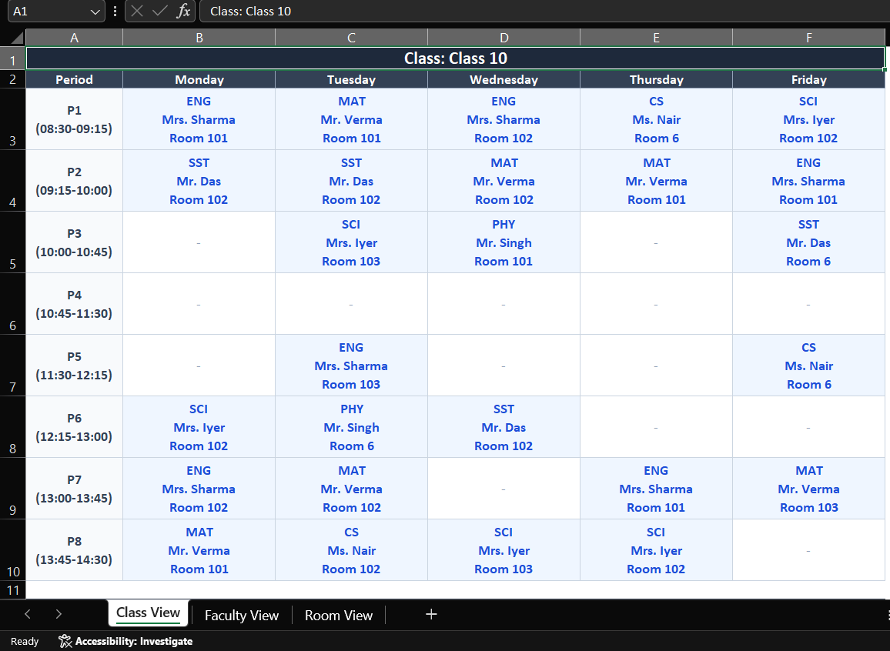
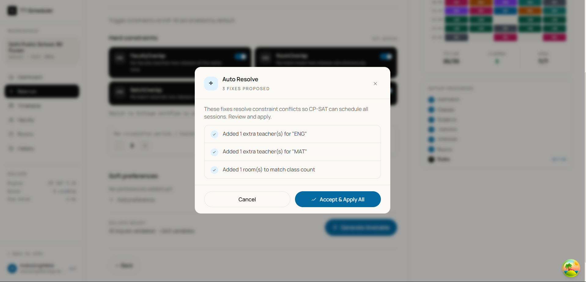

# TT-Scheduler — User Manual

> **Version:** 1.0 &nbsp;|&nbsp; **Last Updated:** April 2026
> **Live App:** [tt-scheduler.vercel.app](https://tt-scheduler.vercel.app)

---

## Table of Contents

1. [Introduction](#1-introduction)
2. [Getting Started](#2-getting-started)
 - 2.1 [Creating an Account](#21-creating-an-account)
 - 2.2 [Logging In](#22-logging-in)
 - 2.3 [Dashboard Overview](#23-dashboard-overview)
3. [Choosing Your Workflow](#3-choosing-your-workflow)
4. [School Workflow — Step-by-Step](#4-school-workflow--step-by-step)
 - Step 1: [Institution Setup](#step-1-institution-setup)
 - Step 2: [Classes / Batches](#step-2-classes--batches)
 - Step 3: [Subjects](#step-3-subjects)
 - Step 4: [Teachers](#step-4-teachers)
 - Step 5: [Schedule](#step-5-schedule)
 - Step 6: [Rooms](#step-6-rooms)
 - Step 7: [Rules & Generate](#step-7-rules--generate)
5. [College Workflow — Step-by-Step](#5-college-workflow--step-by-step)
 - Step 1: [Institution Setup](#college-step-1-institution-setup)
 - Step 2: [Course Offerings](#college-step-2-course-offerings)
 - Step 3: [Faculty](#college-step-3-faculty)
 - Step 4: [Rooms](#college-step-4-rooms)
 - Step 5: [Schedule](#college-step-5-schedule)
 - Step 6: [Constraints](#college-step-6-constraints)
 - Step 7: [Generate](#college-step-7-generate)
6. [Viewing Your Timetable](#6-viewing-your-timetable)
 - 6.1 [Class / Grid View](#61-class--grid-view)
 - 6.2 [Faculty View](#62-faculty-view)
 - 6.3 [Student View](#63-student-view)
 - 6.4 [Analytics View](#64-analytics-view)
7. [Exporting Your Timetable](#7-exporting-your-timetable)
8. [Timetable History](#8-timetable-history)
9. [Auto-Resolve (AI Fix)](#9-auto-resolve-ai-fix)
10. [Constraint Reference](#10-constraint-reference)
11. [Bulk Import via Excel](#11-bulk-import-via-excel)
12. [Troubleshooting](#12-troubleshooting)
13. [FAQ](#13-faq)

---

## 1. Introduction

**TT-Scheduler** is an intelligent, conflict-free timetable generator for schools and colleges. It uses Google's **CP-SAT constraint solver** (the same engine powering Google OR-Tools) to guarantee zero clashes across faculty, rooms, and batches — all in under 60 seconds.

### Key capabilities at a glance

| Feature | Description |
|---|---|
| **CP-SAT Solver** | 8 hard constraints enforced — zero clash, guaranteed |
| **7-Step Wizard** | Guided onboarding for both School and College modes |
| **Per-User Data** | Your inputs and results are saved; pick up where you left off |
| **History** | Browse, compare, and restore any past timetable |
| **4 Views** | Grid, Faculty, Student, and Analytics views |
| **Excel Import/Export** | Bulk-load faculty & courses from `.xlsx`; export full timetable |
| **Secure Auth** | JWT-based login with row-level database security |

---

## 2. Getting Started

### 2.1 Creating an Account

1. Navigate to **[tt-scheduler.vercel.app](https://tt-scheduler.vercel.app)**.
2. Click **"Get started free"** or **"Sign up"** on the landing page.
3. Enter your **email address** and choose a **strong password** (minimum 8 characters).
4. Click **Create Account**.
5. You will be redirected to your **Dashboard** automatically.

> **Note:** Each account's data is completely private — no other user can see your timetables or configuration.

---

### 2.2 Logging In

1. Go to [tt-scheduler.vercel.app/login](https://tt-scheduler.vercel.app/login).
2. Enter your registered **email** and **password**.
3. Click **Log in**.

**Session restoration:** When you log back in, TT-Scheduler automatically restores your last saved state (inputs, generated timetable, etc.) so you can continue exactly where you left off — even from a different device.

---

### 2.3 Dashboard Overview

After logging in you land on the **Dashboard**. This is your command centre.

| Element | Purpose |
|---|---|
| **Stats cards** | Quick summary: timetables generated, faculty, subjects, rooms |
| **Recent timetables** | Your last few generated schedules with restore buttons |
| **+ New Timetable** | Opens the workflow selector to start a new run |
| **View History** | Full history of every timetable you've ever generated |

---

## 3. Choosing Your Workflow

Click **"+ New Timetable"** on the Dashboard. You will be prompted to select a **workflow**:

| Workflow | Best for | Wizard steps |
|---|---|---|
| **School** | K-12 schools, class-based schedules | Institution → Classes → Subjects → Teachers → Schedule → Rooms → Rules |
| **College** | Universities, elective-based scheduling | Institution → Courses → Faculty → Rooms → Schedule → Constraints → Generate |

Click your workflow to begin. The 7-step wizard opens with a **progress bar** at the top and a **Live Draft Preview** panel on the right.

> **Tip:** You can click any numbered step in the progress bar to jump back and make changes — your data is auto-saved at every step.

---

## 4. School Workflow — Step-by-Step

### Step 1: Institution Setup

**Goal:** Name your school and set the academic year.

| Field | Description | Example |
|---|---|---|
| **Institution name** | Your school's official name | `Springfield High School` |
| **Academic year** | Current year/session | `2025-2026` |
| **Type** | Select "School" (pre-selected) | — |

Click **Continue to Classes →** when done.

---

### Step 2: Classes / Batches

**Goal:** Define the classes (sections/divisions) that need timetables.

- Click **+ Add class** to add a row.
- For each class, enter:
 - **Name** — e.g., `10-A`, `Grade 9 Section B`
 - **Size** — number of students (used for room capacity matching)
- Repeat for all classes.
- Use the ** delete** icon to remove unwanted rows.

> **Tip:** Add all sections of the same grade as separate entries (e.g., `10-A`, `10-B`, `10-C`).

Click **Continue to Subjects →**.

---

### Step 3: Subjects

**Goal:** List every subject taught and how many periods per week each class gets.

For each subject row:

| Field | Description | Example |
|---|---|---|
| **Name** | Full subject name | `Mathematics` |
| **Code** | Short code (used internally by solver) | `MATH` |
| **Periods/week** | How many periods this subject runs per week | `5` |
| **Target classes** | Which classes this subject is for (multi-select) | `10-A, 10-B` |

- Click **+ Add subject** to add more rows.
- The **Live Draft Preview** panel on the right updates in real time, showing how full the schedule is and a miniature timetable grid.
- Use ** Import CSV** to bulk-load a prepared spreadsheet (see [Section 11](#11-bulk-import-via-excel)).

> **Important:** The `Code` must be **unique** for each subject. If two subjects share a code the solver will reject the input.

Click **Continue to Teachers →**.

---

### Step 4: Teachers

**Goal:** Add all teaching staff and assign which subjects they can teach.

For each teacher:

| Field | Description | Example |
|---|---|---|
| **Name** | Teacher's full name | `Dr. Jane Smith` |
| **Subjects** | Subject codes this teacher is qualified to teach | `MATH, PHY` |

- Click **+ Add teacher** to add rows.
- A teacher can teach multiple subjects — select all applicable codes from the dropdown.
- Use ** Import from Excel** for bulk entry.

> **Warning:** If a subject has no qualified teacher assigned, the solver will detect the conflict and the **Auto-Resolve** dialog will suggest adding one automatically.

Click **Continue to Schedule →**.

---

### Step 5: Schedule

**Goal:** Define when school happens — days, periods, timings, and lunch.

| Setting | Description | Default |
|---|---|---|
| **Working days** | Check the days school runs | Mon–Fri |
| **Start time** | When the first period begins | `08:00` |
| **Period duration** | Length of each period in minutes | `45 min` |
| **Periods per day** | Total teaching periods per day | `7` |
| **Lunch break** | Toggle to enable a lunch gap | Off |
| **Lunch after period** | Which period lunch follows | `4` |
| **Lunch duration** | Length of the lunch gap in minutes | `30 min` |

A **live time grid preview** updates as you type, showing the exact time each period starts and ends.

> **Note:** Lunch is a **gap** in the schedule, not a teaching period. The total number of teaching periods remains as configured regardless of lunch.

Click **Continue to Rooms →**.

---

### Step 6: Rooms

**Goal:** Register all classrooms and special rooms.

For each room:

| Field | Description | Example |
|---|---|---|
| **Name** | Room identifier | `Room 101`, `Science Lab` |
| **Capacity** | Maximum number of students | `35` |

> **Tip:** Add at least one room per class running simultaneously. If you have 3 classes with periods at the same time, you need at least 3 rooms.

Click **Continue to Rules →**.

---

### Step 7: Rules & Generate

**Goal:** Configure hard constraints and soft preferences, then generate the timetable.

#### Hard Constraints (School Mode — 4 active)

These are always enforced. Toggle any constraint off to disable it:

| # | Constraint | Rule |
|---|---|---|
| C01 | **FacultyOverlap** | No teacher teaches two classes simultaneously |
| C02 | **RoomOverlap** | No room hosts two classes at the same time |
| C03 | **BatchOverlap** | No class attends two subjects simultaneously |
| C04 | **RoomCapacity** | Room size must be ≥ class enrollment |

> **Note:** In School mode, constraints C05–C08 are not shown. Switch to College mode to unlock them.

#### Configurable Limits

| Setting | Description | Range |
|---|---|---|
| **Max consecutive periods / teacher** | Prevents a teacher from teaching back-to-back for too long | 1–8 |
| **Max periods / teacher / day** | Upper cap on how many periods a teacher works in a day | 1–12 |

#### Soft Preferences

Soft preferences are optional hints — the solver tries to honour them but won't fail if it can't:

- **Avoid day** — e.g., *Teacher X should not teach on Wednesdays*
- **Avoid period** — e.g., *Math should not be scheduled in period 7*
- **Prefer period** — e.g., *Science lab preferred in periods 5–6*
- **Spread subject** — Ensure a subject is not bunched on one day
- **Group on day** — Keep a teacher's classes together on one day

Click **+ Add preference**, choose the type, fill in the target and timing, and set a weight (1–5, where 5 is strongest).

#### Generating the Timetable

1. Review that all data looks correct in the **Live Draft Preview** sidebar.
2. Click ** Generate timetable**.
3. A **solving overlay** appears showing real-time progress:
 - Validating problem → Building model → Running diagnostics → CP-SAT search → Extracting solution
4. Typically completes in **under 60 seconds**.
5. On success, you are automatically redirected to the **Timetable Grid view**.

---

## 5. College Workflow — Step-by-Step

The College workflow uses the same 7-step structure but is optimised for university scheduling with elective courses, multiple batches per department, and more advanced constraints.

### College Step 1: Institution Setup

Same as School Step 1. Enter your **university/college name** and **academic year**.

---

### College Step 2: Course Offerings

**Goal:** Define all courses being offered this semester.

For each course:

| Field | Description | Example |
|---|---|---|
| **Course name** | Full course title | `Data Structures & Algorithms` |
| **Course code** | Unique identifier | `CS301` |
| **Credits / Hours per week** | Weekly contact hours | `3` |
| **Type** | Lecture, Lab, Tutorial | `Lecture` |
| **Batch / Section** | Which student group takes this | `CSE-A`, `CSE-B` |
| **Enrollment** | Number of students | `60` |

> **Lab courses** are automatically scheduled **back-to-back** (consecutive periods) by the solver — no extra configuration needed.

Use ** Import from Excel** to upload a course list spreadsheet.

---

### College Step 3: Faculty

Same structure as School Step 4, but with additional fields:

| Field | Description |
|---|---|
| **Max hours/week** | Contract teaching limit (e.g., 16 hours) |
| **Courses qualified** | Assign one or more course codes |

---

### College Step 4: Rooms

Same as School Step 6. For colleges, distinguish between:
- **Lecture halls** (large capacity, projector)
- **Computer labs** (fixed workstations, specific capacity)
- **Tutorial rooms** (small group)

Tag rooms with features (lab, projector) so the solver can match them to course requirements.

---

### College Step 5: Schedule

Same as School Step 5. Universities often have:
- 5 or 6 working days
- Periods starting from 08:00 or 09:00
- 50- or 55-minute periods
- A lunch break after period 4 or 5

---

### College Step 6: Constraints

All **8 hard constraints** are available in College mode:

| # | Constraint | Rule |
|---|---|---|
| C01 | **FacultyOverlap** | No faculty teaches two courses simultaneously |
| C02 | **RoomOverlap** | No room hosts two classes simultaneously |
| C03 | **BatchOverlap** | No batch attends two courses simultaneously |
| C04 | **RoomCapacity** | Room must fit enrolled students |
| C05 | **CourseHours** | Each course gets exactly its required weekly contact hours |
| C06 | **FacultyWorkload** | Faculty hours stay within their contract maximum |
| C07 | **RoomFeatures** | Rooms match course type (lab ↔ lab course, projector for lectures) |
| C08 | **LabConsecutive** | Lab sessions are always consecutive (back-to-back) |

---

### College Step 7: Generate

Same generation flow as School Step 7. Click ** Generate timetable**. The College solver handles significantly more variables (~1,428 variables, ~8,214 constraints) but still completes in under 60 seconds for typical institutions.

---

## 6. Viewing Your Timetable

After generation, four view modes are available from the top navigation:

### 6.1 Class / Grid View

The default view. Shows a **weekly grid** for each class/batch:

- **Rows:** Periods (with time labels, e.g. P1 08:30–09:15)
- **Columns:** Days of the week (Mon–Fri)
- **Cells:** Subject code, teacher name, room number
- **Color coding:** Each subject gets a unique color for quick visual scanning
- **Status bar:** Shows solver (CP-SAT), total assignments, solve time, and clash count (always 0)

Use the **class tabs** (Class 7, Class 8…) at the top to switch between classes/batches. Click **Faculty / Student / Analytics** tabs to switch views.

---

### 6.2 Faculty View

Shows each **faculty member's weekly schedule**:

- Click a **teacher name chip** at the top to switch between staff members
- Quickly identify a teacher's **free periods** (empty cells)
- The header shows: *Periods/week · Subjects · Classes assigned*
- Check if any teacher is overburdened before finalising

Each cell shows: *Subject → Class → Room*

---

### 6.3 Student View

Shows a **student's personal timetable** based on their enrolled courses/batch:

- Filter by batch/section
- Each row is a period; columns are days
- Empty cells are free periods

---

### 6.4 Analytics View

Provides **utilisation metrics** for the generated schedule:

The Analytics page is split into four panels:

| Panel | What it shows |
|---|---|
| **Summary bar** | Total assignments · Classes · Teachers · Subjects · Rooms · Solve time |
| **Teacher Workload** | Each teacher's total periods/week with a horizontal bar, plus which subjects and classes they cover |
| **Subject Distribution** | Periods per subject across all classes, with average periods/class |
| **Room Utilisation** | Sessions and occupancy % per room (colour-coded: green = healthy, red = heavily used) |
| **Sessions per Day** | How periods are distributed across Mon–Fri |

---

## 7. Exporting Your Timetable

TT-Scheduler can export your complete timetable as a multi-sheet Excel workbook.

### Excel export

The exported `.xlsx` file contains **three sheets** accessible via tabs at the bottom:

| Sheet | Contents |
|---|---|
| **Class View** | One table per class — periods as rows, days as columns. Each cell shows Subject · Teacher · Room |
| **Faculty View** | Each teacher's weekly schedule in the same grid format |
| **Room View** | Each room's occupancy across the week |

### How to export to Excel

1. From any timetable view, click ** Export** (bottom-right or top-right toolbar).
2. Select **"Download Excel"**.
3. The file downloads automatically as `[InstitutionName]_Timetable.xlsx`.
4. Open in Microsoft Excel, LibreOffice, or Google Sheets.

### How to export PDFs

1. Click ** Export**.
2. Select the view you want (Class Grid, Faculty, Student, Analytics).
3. Click **"Download PDF"** — the currently visible view is saved as a PDF file.

---

## 8. Timetable History

Every successfully generated timetable is **automatically saved** to your account.

Access it via:
- **Dashboard → "View History"** button, or
- **Sidebar → History** icon

### History page features

| Feature | How to use |
|---|---|
| **Browse** | Scroll through all past timetable runs, ordered newest first |
| **Preview** | Click any entry to see a compact grid preview |
| **Restore** | Click **"Restore"** to reload that timetable's full setup and result |
| **Compare** | Use **"Compare"** to open two timetables side by side |
| **Delete** | Click the ** Delete** icon; confirm the prompt to permanently remove a snapshot |

> **Restore** loads the timetable's **full input state** as well (teachers, subjects, rooms, schedule settings). This lets you tweak inputs and re-generate from a historical baseline.

---

## 9. Auto-Resolve (AI Fix)

When the solver detects constraint violations or can't place all sessions, it shows an **Auto-Resolve** dialog instead of just an error.

### What triggers Auto-Resolve?

- A subject has no qualified teacher assigned
- A teacher's subject codes are invalid/mismatched
- The schedule is oversubscribed (too many periods requested vs. available slots)
- A teacher's capacity is exceeded (too many sessions, not enough teachers)
- A class has no suitable room

### How to use it

1. The **Auto Resolve** modal appears after generation, showing the number of fixes proposed.
2. Each fix is listed with a checkmark — e.g.:
 - *"Added 1 extra teacher(s) for 'ENG'"*
 - *"Added 1 extra teacher(s) for 'MAT'"*
 - *"Added 1 room(s) to match class count"*
3. Click **"Accept & Apply All"** to apply every fix and immediately re-run the solver.
4. Click **Cancel** to dismiss and manually correct the inputs yourself in earlier steps.

After a successful re-generation, a **Rename prompt** may appear if placeholder teachers or rooms were added — you can give them real names before the timetable is finalised.

> **Tip:** If you only want to fix some issues manually, click Cancel, go back to the relevant step, make your changes, and click Generate again.

---

## 10. Constraint Reference

### Hard Constraints

These are enforced absolutely — if violated, the solution is rejected.

| Code | Name | Condition for violation |
|---|---|---|
| C01 | FacultyOverlap | Two lessons with the same teacher scheduled at the same time |
| C02 | RoomOverlap | Two lessons in the same room at the same time |
| C03 | BatchOverlap | A class/batch has two subjects at the same time |
| C04 | RoomCapacity | Room capacity < batch enrollment |
| C05 | CourseHours | Fewer periods scheduled than the course's required weekly hours |
| C06 | FacultyWorkload | Teacher's total hours exceed their contract maximum |
| C07 | RoomFeatures | A lab course placed in a non-lab room, or a lecture in a room without required features |
| C08 | LabConsecutive | A lab session is split across non-consecutive periods |

### Soft Preferences (School Mode)

These are hints. The solver gives penalty scores to violations but still produces a schedule:

| Type | What it does |
|---|---|
| `avoid_day` | Avoid scheduling target on a specific day |
| `avoid_slot` | Avoid scheduling target in a specific period |
| `prefer_slot` | Prefer scheduling target in a specific period |
| `spread_subject` | Distribute a subject evenly across the week |
| `group_on_day` | Keep a teacher's classes on one or two days |

**Weight** (1–5) controls how strongly the solver tries to honour the preference. Weight 5 is almost as strong as a hard constraint.

---

## 11. Bulk Import via Excel

TT-Scheduler supports importing **faculty** and **courses/subjects** from Excel spreadsheets.

### Faculty import template

Your `.xlsx` file should have the following columns (first row = header):

| Column | Required | Example |
|---|---|---|
| `name` | | `Dr. Jane Smith` |
| `subjects` | | `MATH,PHY` (comma-separated codes) |
| `max_hours_per_week` | (College only) | `16` |

### Subject/Course import template

| Column | Required | Example |
|---|---|---|
| `name` | | `Mathematics` |
| `code` | | `MATH` |
| `periods_per_week` | | `5` |
| `target_classes` | | `10-A,10-B` |

### Steps to import

1. Prepare your `.xlsx` file using the columns above.
2. In the **Teachers** or **Subjects** wizard step, click ** Import from Excel**.
3. Select your file.
4. Imported rows appear in the table — review and correct any highlighted errors.
5. Continue to the next step.

---

## 12. Troubleshooting

### "No valid subjects found"

**Cause:** Step 3 (Subjects) was skipped or all subject rows are empty.
**Fix:** Go back to Step 3 and add at least one subject with a name and code.

---

### "No valid classes found"

**Cause:** Step 2 (Classes) was skipped or all class rows are empty.
**Fix:** Go back to Step 2 and add at least one class.

---

### "Cannot reach backend"

**Cause:** The backend server is not responding (likely a cold start on Render's free tier).
**Fix:** Wait 30–60 seconds and try again. Render free instances sleep after inactivity and need time to wake up.

---

### "Solver took too long"

**Cause:** The problem is too large or too constrained for the solver to find a solution within the timeout.
**Fix options:**
- Reduce **periods per week** for some subjects.
- Add more **rooms**.
- Add more **teachers**.
- Reduce the number of **soft preferences**.
- Use the **Auto-Resolve** suggestions.

---

### Timetable generated but some sessions are missing

**Cause:** The solver couldn't place every session (reported as "unplaced sessions" in Analytics).
**Fix:** Check Analytics View → Unplaced sessions. Common causes: not enough rooms, teacher overloaded, too many periods per week relative to available slots.

---

### "INFEASIBLE" result

**Cause:** The constraints make it mathematically impossible to produce any valid timetable.
**Fix:** Review Analytics for the most violated constraint, then loosen it — e.g., reduce required periods, add more rooms, or add more teachers.

---

### Login not working

**Fix:** Ensure you are using the correct email. If you forgot your password, use the **"Forgot password"** link on the login page (Supabase sends a reset email).

---

## 13. FAQ

**Q: Can I use TT-Scheduler for both a school and a college?**
A: Yes. You can create separate timetable runs — one using the School workflow and another using the College workflow — all under the same account.

---

**Q: Is my data safe?**
A: Yes. All data is stored in Supabase with **Row-Level Security** (RLS) enabled — only your account can read or write your data. Authentication uses industry-standard JWT tokens.

---

**Q: How many classes/teachers/subjects can I add?**
A: There is no hard UI limit. However, very large problems (100+ classes, 200+ teachers) may increase solve time. For best results, keep the number of periods per week reasonable and ensure teacher capacity matches demand.

---

**Q: Can I edit a timetable after it's generated?**
A: TT-Scheduler does not support manual cell editing yet. To change the schedule, modify your inputs (teachers, subjects, rooms, rules) and click **Generate** again. Your new timetable is saved alongside the previous one in History.

---

**Q: What happens if I close the browser mid-wizard?**
A: Your inputs are auto-saved at every step. When you log back in, TT-Scheduler restores your session automatically — you won't lose any data.

---

**Q: Can I download my timetable for offline use?**
A: Yes. Use the Export feature to download an Excel (.xlsx) file or PDFs. These can be shared, printed, or opened offline.

---

**Q: What's the difference between hard constraints and soft preferences?**
A: **Hard constraints** are never violated — if they can't be satisfied, the solver fails and reports a conflict. **Soft preferences** are best-effort — the solver tries to honour them but will still produce a schedule even if it can't.

---

**Q: Can multiple users collaborate on the same timetable?**
A: Not currently — each account is independent. Sharing a timetable requires exporting it (Excel/PDF) and sending the file.

---

*For technical issues or feature requests, open an issue at the [GitHub repository](https://github.com/your-username/TT-Scheduler) or contact the development team.*

---

**TT-Scheduler** — Conflict-free timetables in seconds.
Built with Google OR-Tools CP-SAT.

[ Live App](https://tt-scheduler.vercel.app) &nbsp;•&nbsp; [ API Docs](https://tt-scheduler.onrender.com/api/v1/docs)

